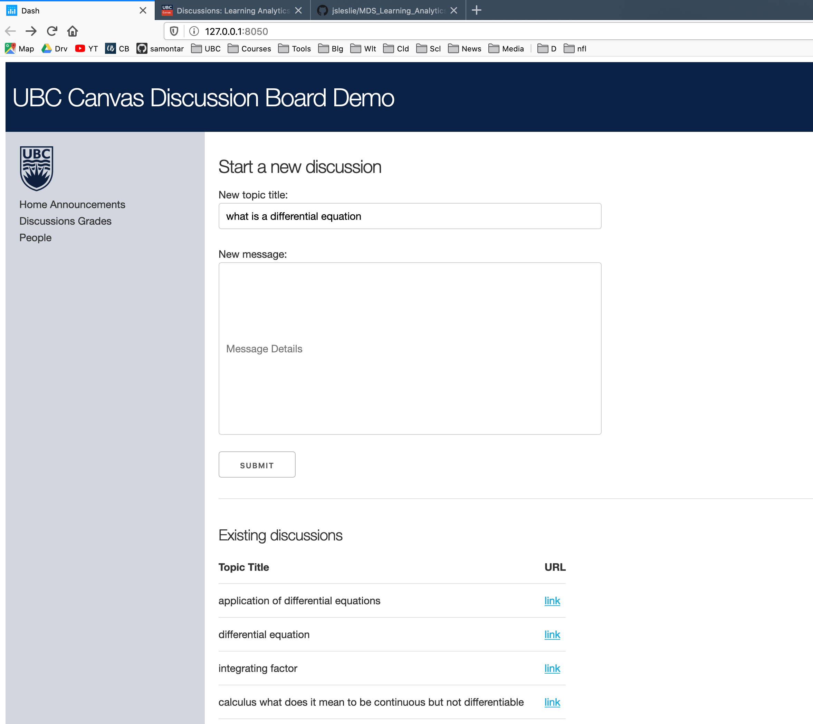

# UBC Learning Analytics Hackathon

Topic: Improving student experience on Canvas discussion boards

Authors: Anas Muhammad, Alexander Hinton, Sam Edwardes, Jarome Leslie

Program: Master of Data Science

Demo link: [https://ubc-canvas-discussion-board.herokuapp.com/](https://ubc-canvas-discussion-board.herokuapp.com/)

### Problem

- Canvas discussion boards are too cluttered and may be intimidating for students

### Goal

- Make the canvas discussion environment more user friendly and helpful for students
- Encourage student participation on canvas in getting their questions asked

### Tool

Screenshot of web app:

### Presentation

Our presentation may be found here: [Canvas thread recommender presentation](https://github.com/jsleslie/MDS_Learning_Analytics/blob/master/pres/Canvas_thread_recommender.pptx)